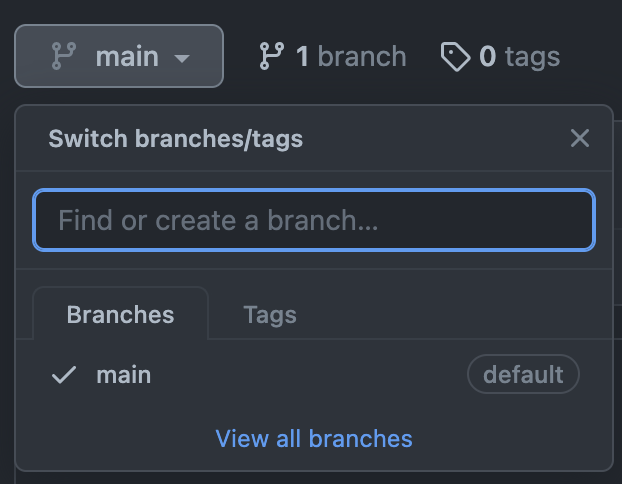
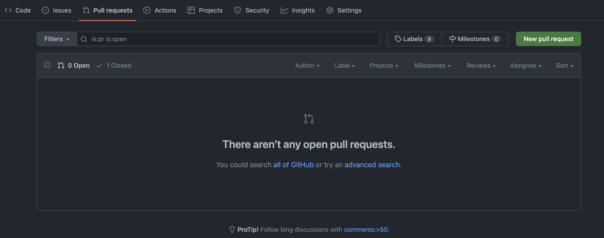

# Week 1 - Learning GitHub
This is intended to get a quick wrap of how things work.

## 1. Create a branch. 
On the github page, click on the branches button. Make a branch with your name by writing it in the search bar and pressing enter.

## 2. Set up github
In your terminal / console, cd to your prefered directory.
`git clone` the repository (https://github.com/Codify-Club-Berkeley/Example-repo.git)
To switch to the branch you've just created, follow these instructions:
https://stackoverflow.com/questions/1783405/how-do-i-check-out-a-remote-git-branch

## 3. Follow the tutorial to make a basic app.
If you're in **UI** or **API**, this is https://reactjs.org/tutorial/tutorial.html

If you're working on the keyboard, follow https://developer.apple.com/tutorials/swiftui/creating-and-combining-views

If you have any concerns regarding the difficulty of these tutorials, please come ask me.

## 4. Once you've finished
After `git push`-ing everything to github, go back to the github page to create your pull request.
On the pull requests tab, click on create a new pull request and write anything in the description. I'll approve it after reviewing the code.

